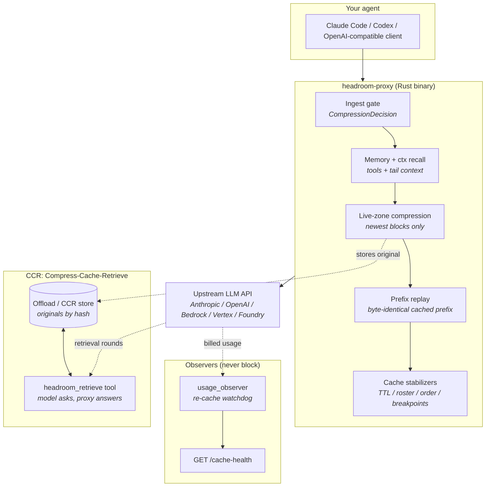

# Headroom Architecture

Headroom is a local reverse proxy between your coding agent and the model API.
You run it with `cclaude` (never plain `claude`), it intercepts LLM traffic on
localhost, compresses the wasteful parts, keeps the provider's prompt cache
warm, and forwards the result upstream. Compression is deterministic —
statistical analysis and rules, no LLM calls — so it adds milliseconds, not
dollars.



!!! note "Where the code lives"
    The product is the `crates/` Rust workspace. `upstream-python/` is a
    read-only mirror of the upstream Python repo used for porting — see
    [Upstream Python mirror](#upstream-python-mirror-read-only) at the bottom.
    This page describes the Rust system.

---

## What problem does Headroom solve?

1. **Tool outputs are huge**: agent tool calls (search, file reads, metrics)
   return massive repetitive payloads.
2. **Most of it is redundant**: constant fields, stable time-series regions,
   near-duplicate log lines.
3. **Providers bill cached prefixes cheaply but rewrites dearly**: any byte
   change in the cached prefix turns a ~90% read discount into a full rewrite.
4. **Context windows fill up**: bloated history crowds out working space.

Headroom compresses the newest content, replays the already-cached prefix
byte-identical so the provider cache keeps hitting, and makes every compression
reversible: the model can retrieve the original via a tool call.

---

## Workspace map

| Crate | Role |
|-------|------|
| `crates/headroom-proxy` | The product: HTTP proxy, request pipeline, cache stabilization, memory/ctx wiring, SSE handling, observability |
| `crates/headroom-core` | Shared logic: transforms (smart_crusher, content_router, cache_aligner, …), CCR store/tracker, ctx sessions store, tokenizer, pricing, retry |
| `crates/headroom-simulators` | Deterministic fake provider upstream for local and CI validation (`crates/headroom-simulators/src/lib.rs`) |
| `crates/headroom-parity` | Fixture harness comparing the Rust ports against recordings from the Python implementation (`crates/headroom-parity/src/lib.rs`) |
| `crates/headroom-py` | PyO3 bindings exposing `headroom-core` to Python as `headroom._core` (`crates/headroom-py/src/lib.rs`); built via maturin, not plain cargo |

!!! note "Build note"
    `headroom-py` needs maturin (`extension-module` must not link libpython),
    so the workspace `default-members` in `Cargo.toml` exclude it. `cargo test
    --workspace` still runs its tests.

---

## The request pipeline (`forward_http`)

`crates/headroom-proxy/src/proxy.rs`, `forward_http` is the single request
path. POSTs to a compressible endpoint (`/v1/messages`, `/v1/chat/completions`,
`/v1/responses`, plus Bedrock/Vertex/Foundry equivalents) take the buffered
arm; everything else streams through byte-faithful. Each stage is timed by
`crates/headroom-proxy/src/stage_timer.rs` (`StageTimer`: `buffer`, `parse`,
`memory`, `compression`, `replay`, `rewrite`, `footprint`, `post`,
`pre_forward`, `upstream`). `parse`/`rewrite`/`post` are measurement gaps,
not work stages: `parse` spans buffer end through the ctx block (it contains
`memory` — subtract to isolate repeated parses), `rewrite` covers the
router/prune/image chain, `post` covers footprint end to `pre_forward`.

```
buffer → parse → memory → compression → replay → rewrite → footprint → post → pre_forward → upstream
```

### 1. Buffer + ingest gate

The body is buffered (bounded by `compression_max_body_bytes`; oversize fails
loud with 413 rather than half-streaming). The
`crates/headroom-proxy/src/compression_decision.rs` gate runs twice: at ingest
on header/config inputs only (`x-headroom-bypass` / passthrough mode route to
the streaming arm immediately), then refined after the body parses when
`has_messages` is known.

Endpoint classification (`compression::classify_compressible_path`) picks one
of three dispatchers: `AnthropicMessages`, `OpenAiChatCompletions`,
`OpenAiResponses`. `CompressionMode` (`crates/headroom-proxy/src/config.rs`)
is `Off` (byte-equal forwarding) or `LiveZone`.

### 2. Sidecar short-circuit

Claude Code's spinner-text sidecar resends the whole conversation to render a
four-word status line (`crates/headroom-proxy/src/sidecar.rs`, detected by the
`DESCRIBE_ACTION_PREFIX` block). It is answered with a tail-only request to a
small model before any pipeline state runs, so it neither bills a full prefix
read nor poisons the replay store. Any failure falls through to the normal
path — the client is never worse off.

### 3. Observe (read-only)

On the parsed body, before any mutation: volatile-content warnings
(`cache_stabilization/volatile_detector.rs`), hot-zone drift fingerprinting
(`cache_stabilization/drift_detector.rs`), per-lane session identity, and
`usage_observer.begin_request` parking the turn's identity for the
response-side watchdog. Semantic-cache lookup
(`crates/headroom-proxy/src/semantic_cache.rs`) can serve identical
non-streaming requests without touching upstream at all.

A drift/rebuild boundary (client changed system/tools/early messages) sets
`rebuild_boundary` and invalidates the lane's stored prefix — the provider's
cache is gone, so replay must start a fresh chain.

### 4. Memory + ctx transforms

Before compression, in one stage (`memory` in the stage timer):

- **CTX-4 recall injection** (`ctx/inject.rs`): prepends a once-decided,
  timestamp-free recall/resume block into the first user message, replayed
  verbatim every turn so the prefix never drifts.
- **CTX-3 offload** (`compression/ctx_offload.rs`): replaces oversized
  `tool_result` blocks with digests; originals persist via `ctx/offload_store.rs`
  into the CCR store + FTS index. First conversions of frozen history ride only
  on a rebuild boundary (`OffloadPolicy`); the live tail always passes.
- **Memory tools + tail context** (`memory/handler.rs`,
  `memory/tool_adapter.rs`, `memory/ctx_backend.rs`): injects memory tool
  definitions and appends retrieved context to the latest user-message tail
  (cache-safe: the tail is re-sent every turn anyway). Backed by an FTS5 store
  with an in-memory fallback; `memory/router.rs` scopes partitions per project
  so projects never see each other's memories.
- **CCR tool injection**: adds the `headroom_retrieve` definition once content
  has been offloaded, and an `InjectionBudget`
  (`crates/headroom-proxy/src/injection_budget.rs`) caps what all appenders may
  add combined.

!!! warning "Ordering invariant"
    The replay snapshot of the client's original messages is captured *before*
    this stage. Capturing after it compared our own offload output against our
    own output, declined to replay, and blamed the client — one such bust cost
    ~452k tokens on a single turn.

### 5. Live-zone compression

Only the **live zone** — the newest content blocks — is ever compressed. The
cache hot zone (system prompt, tool definitions, older turns) is never
mutated, so earlier turns stay byte-stable and keep hitting the provider KV
cache. Dispatchers live in `compression/live_zone_anthropic.rs`,
`compression/live_zone_openai.rs`, and `compression/live_zone_responses.rs`;
the per-type compressors (smart_crusher, content_router, code/log/search/diff
compressors, cache_aligner) live in `crates/headroom-core/src/transforms/`.
Passthrough promises byte-equal output, enforced by a bytes-modified alarm.

Post-passes: cross-turn verbatim dedup (`compression/cross_turn.rs`, opt-in),
prior-thinking strip on rewritten history (`compression/prior_thinking.rs`),
tool pruning, tool-schema compaction
(`crates/headroom-proxy/src/tool_schema_compaction.rs`), image optimization.

### 6. Prefix replay + stabilizers

`cache_stabilization/prefix_replay.rs` replays the previously *forwarded*
(compressed) prefix byte-for-byte when the turn append-only-extends the last
one; only the new delta goes out as fresh compressor output. Comparison is
content-only via `canonicalize_for_prefix_compare`, and
`normalize_message_cache_control` keeps Anthropic breakpoints bounded (max 4)
and stable so the overlay itself never busts.

Around it, in wire order: working-directory and role-sentence holds, tool
roster pinning (`tool_roster_pin.rs`), stable tool ordering (`tool_order.rs`),
tail breakpoint (`message_breakpoints.rs`), cache-TTL pinning
(`cache_ttl.rs`), billing-header pinning (`billing_header.rs`), sticky beta
headers (`beta_sticky.rs`), OpenAI `prompt_cache_key` injection
(`openai_cache_key.rs`, PAYG only), and TTL ordering (`ttl_order.rs`). Cost-aware
model routing (`crates/headroom-proxy/src/model_router.rs`) runs before these
so routed model ids are cleaned too.

### 7. Footprint → pre_forward → upstream

`spawn_request_footprint` records what the proxy added versus the client's
bytes (own cost must not hide in its own baseline), plus wire byte counts and
a `turn_cache_fingerprint` of the cache-key inputs for offline diffing. Then
`pre_forward` is recorded — everything after it is provider time — and the
request goes upstream with retries: 429/529/5xx with backoff honoring
`Retry-After`, leading-error-in-200 SSE peeks, and early-drop stream resume
(`sse/stream_retry.rs`).

---

## CCR: Compress-Cache-Retrieve

The key insight: compression must be **reversible**. If we guess wrong about
what matters, the model fetches the original instead of failing.

- **Store**: offload/CCR originals keyed by hash
  (`crates/headroom-core/src/ccr/`, `batch_store.rs`); TTL-bounded, LRU-evicted.
- **Inject**: `headroom_retrieve` tool definition on turns with offloaded
  content (`crates/headroom-core/src/ccr/tool_injection.rs`).
- **Resolve, streamed**: `sse/ccr_stream.rs` answers the tool call mid-stream —
  suppressing the block, running a continuation round against upstream, splicing
  the result back — so streamed turns behave like buffered ones.
- **Resolve, buffered**: non-streaming turns and streaming `/v1/responses`
  (which has no stream rewriter) resolve server-side; the latter is flipped to
  a buffered upstream call and re-framed as SSE
  (`crates/headroom-proxy/src/openai_buffered_ccr.rs`).
- **Continuations**: rounds append to the *forwarded* body (transforms intact,
  so the cached prefix survives) and their billed usage folds into the
  outcome; a bound caps ping-ponging between retrieval and memory rounds.
- **Learn**: `crates/headroom-proxy/src/compression_feedback.rs` tracks
  retrieval rates per tool and emits hints (back off, or skip compression when
  the model always retrieves everything).
- **Multi-turn**: `crates/headroom-core/src/ccr/context_tracker.rs`
  proactively expands previously compressed content when a new query matches it.

See `wiki/ccr.md` for the operator-facing details.

---

## Memory and ctx: two systems, different jobs

| | `memory/` (agent memory) | `ctx/` (conversation context) |
|---|---|---|
| Question | "What should the model remember across sessions?" | "What in this conversation is worth keeping or offloading?" |
| Write path | `memory/handler.rs` + `memory/ctx_backend.rs` (FTS5) | `ctx/observer.rs` passive capture → `headroom-core/src/ctx/store.rs` sessions DB |
| Read path | tool definitions + tail context injection | `ctx/inject.rs` recall block; `ctx/fetch.rs` + `ctx/endpoints.rs` serve reads |
| Project isolation | `memory/router.rs` scoped user ids | `ctx/projects.rs` per-project store registry |

Shared core types live in `crates/headroom-core/src/ctx/` (`store.rs`,
`sessions.rs`, `snapshot.rs`) and `crates/headroom-core/src/memory/`. With the
exception of `ctx/inject.rs`, everything in `ctx/` is a pure observer — no wire
bytes mutated, no request-path latency. `memory/deferred.rs` holds answers from
turns that also called client tools until the client's `tool_result` arrives.

See `wiki/memory.md` for configuration.

---

## Cache stabilization in one paragraph

Provider caches key on exact prefix bytes, so every subsystem that touches the
wire exists to keep those bytes still: prefix replay (byte-identical
forwarded prefix), drift + volatile detectors (name the bust when bytes move),
TTL/roster/order/breakpoint pins (deterministic markers), billing-header and
working-directory holds (client churn masked), beta stickiness (union of betas
forwarded), and the usage observer proving it worked. If a re-cache happens
anyway, `turn_cache_fingerprint` + `prefix_digest_ladder` log the facts for
offline diffing instead of guessing.

---

## Observability

- **Re-cache watchdog** (`cache_stabilization/usage_observer.rs`): the
  response-side complement to the drift detector. Healthy caches satisfy
  `cache_read(N) ≈ cache_read(N-1) + cache_creation(N-1)`; a drop plus a
  creation spike is a re-cache event with billed-token cost and drift-axis
  attribution. Gaps past the cache TTL classify as expiry, not defects.
- **`GET /cache-health`**: serves the watchdog snapshot (hit rates, re-cache
  counts, upstream health) — cheap enough for a statusline to poll every few
  seconds (`proxy.rs`, `cache_health`).
- **Per-request books**: `OutcomeContext` carries compression savings, wire
  bytes, forwarded-token estimates, waste signals, and hidden continuation
  usage into the cost/savings/request loggers
  (`crates/headroom-core/src/savings_ledger.rs`,
  `cost_tracker.rs`, `request_logger.rs` in proxy).
- **Stage timing**: `StageTimer` snapshots ride the structured log line, so a
  latency complaint resolves to a stage, not a gap between log lines.
- **Capture**: `cache_stabilization/capture.rs` + `probe_recorder.rs` record
  bodies/events for the offline simulator when env-gated on.

---

## Response path

SSE responses tee each chunk into a bounded channel for a spawned state-machine
task (usage observer, hit-rate metrics, watchdog). The channel uses `try_send`:
if the parser falls behind, bytes are dropped and logged — **the byte path to
the client never blocks**. Provider arms live in `sse/anthropic.rs`,
`sse/openai_chat.rs`, and `sse/openai_responses.rs`; non-SSE bodies stream
through opaquely.

---

## Key design decisions

### 1. Live-zone-only compression

The hot zone is never mutated. Only the newest blocks change, so the cached
prefix stays byte-stable across turns and compression is fully reversible via
CCR. See `crates/headroom-core/src/transforms/live_zone.rs`.

### 2. Deterministic transforms

No LLM calls for compression: statistical analysis, pattern matching, rules.
Predictable, millisecond-scale, no added API cost. Optional ML paths
(Kompress) stay opt-in.

### 3. Cache safety as an invariant, not a hope

Passthrough arms promise byte-equal output and an alarm fires when they break
it. Mutations after replay (prune, compaction, ordering) are allowlisted and
deterministic; cross-turn stability is measured (`prefix_ladder`), not assumed.

### 4. Observers never block

Drift, capture, ctx observe, footprint, and the SSE state machine all work off
clones, detached tasks, or drop-on-overflow channels. A slow observer costs
telemetry, never latency.

### 5. Auth-mode-aware policy

`auth_mode` + `CompressionPolicy` (`crates/headroom-core/src/compression_policy.rs`,
`auth_mode.rs`) are classified once at request entry and threaded through:
PAYG-only mutations (e.g. `prompt_cache_key`, 1h TTL pin) never touch
subscription/OAuth bytes.

---

## What this is not

- **Not summarization**: deterministic, ~ms overhead, no extra API cost,
  preserves structure, cannot hallucinate.
- **Not truncation**: keeps change points, errors, and outliers by analysis;
  factors out constants; worst case falls back to the stored original.

> **Audit note (2026-09-02):** the illustrative token counts previously shown
> here could not be traced to any benchmark, test, or committed artifact and
> were removed. For sourced compression numbers see [Benchmarks](benchmarks.md).

---

## Upstream Python mirror (read-only)

`upstream-python/` mirrors upstream `headroomlabs-ai/headroom` (see
`upstream-python/README.md`) so upstream releases can be merged, diffed, and
ported into `crates/`. It is not built, tested, installed, or published here —
edit the Rust side instead so upstream merges keep applying cleanly.

!!! warning "Do not edit `upstream-python/`"
    Changes there break the merge workflow. Port the behavior to the
    corresponding crate module and cover it with a parity fixture
    (`crates/headroom-parity/src/lib.rs`, recorded via
    `upstream-python/tests/parity/recorder.py`) instead.

The old SDK entry points (`HeadroomClient`, `compress()`, LangChain/Agno
integrations) live only in that mirror. The shipped Python artifact is
`headroom-py`: PyO3 bindings over `headroom-core`, built with maturin.

---

## Summary

**Headroom is a local proxy that:**

1. **Buffers** eligible LLM requests and classifies them once
2. **Recalls** memory and conversation context into the live tail
3. **Compresses** only the newest blocks, storing originals for retrieval
4. **Replays** the cached prefix byte-identical so provider caches keep hitting
5. **Stabilizes** markers, ordering, TTLs, and client-churned headers
6. **Answers** `headroom_retrieve` rounds server-side, billed transparently
7. **Proves** it worked via the usage watchdog and `/cache-health`
